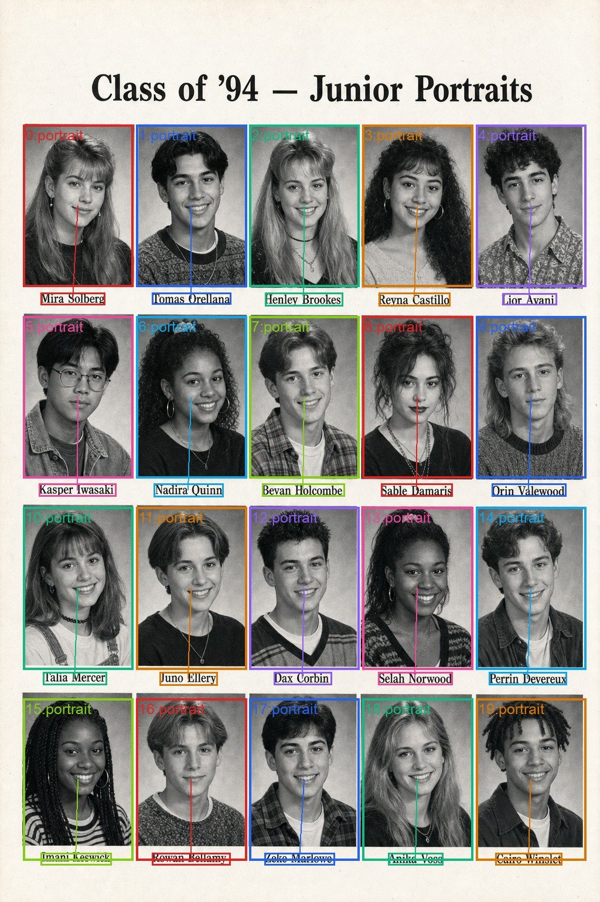
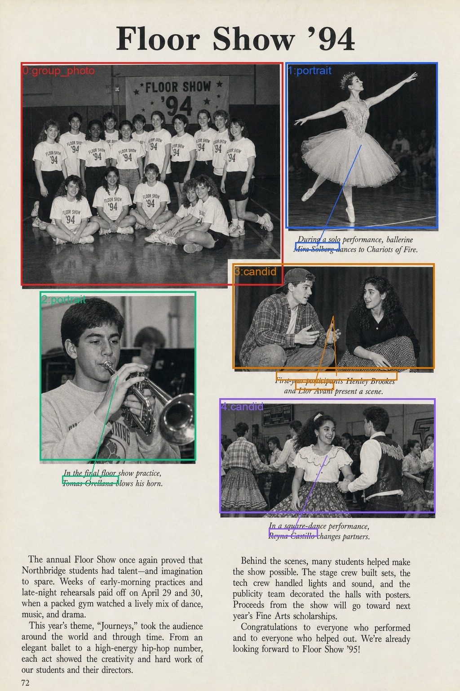
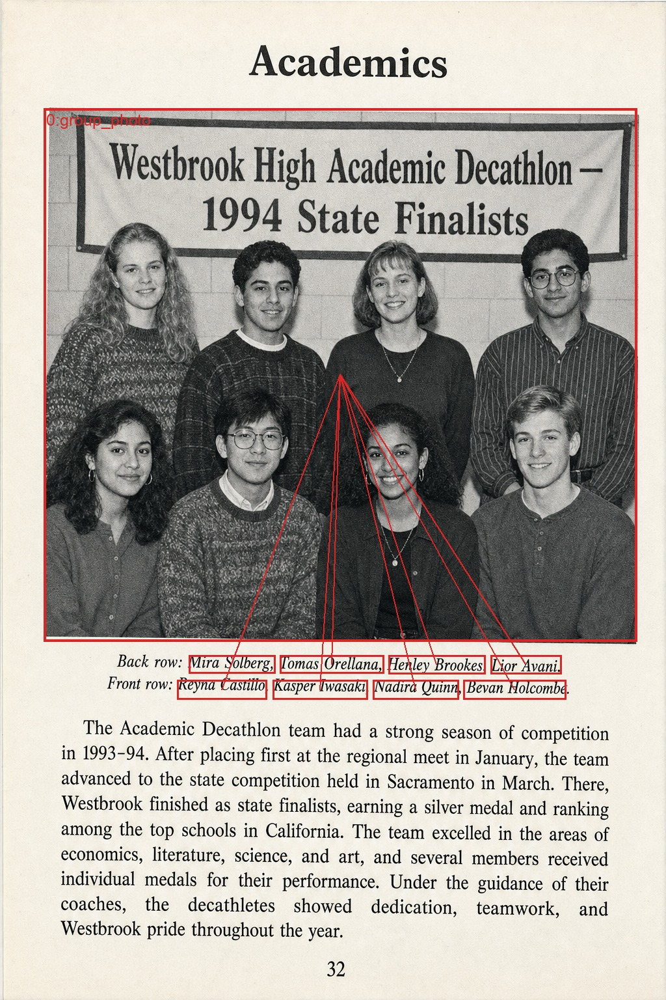

# Hybrid vision + spatial reasoning on Amazon Bedrock

This pattern matches printed names to the photographs they belong to on a scanned page using two Amazon Bedrock models: **Amazon Nova 2 Lite** for native multimodal extraction and **Anthropic Claude Sonnet 4.6** for spatial reasoning. The example data is a yearbook layout — portrait grids, mixed group/candid spreads, and roster-style group photos — and the same pattern applies to many documents where the link between a photo and the people in it lives only in the page layout (for example, real estate listings, personnel directories, magazine spreads, and product catalogs).

```
                        ┌────────────────────────────┐
                        │    Scanned page (image)    │
                        └─────────────┬──────────────┘
                                      │
                                      ▼
        ┌────────────────────────────────────────────────────────────┐
        │  Stage 1 — Amazon Nova 2 Lite (InvokeModel, temp=0)        │
        │  Native multimodal extraction in a single call:            │
        │    • photos[]   bbox + type (portrait / group / candid)    │
        │    • names[]    text + bbox of every printed name          │
        │    • page_title, page_category, page_summary               │
        │    • all bounding boxes on a 0–1000 normalized grid        │
        └─────────────┬──────────────────────────────────────────────┘
                      │ (image bytes + photos + names, same 0–1000 grid)
                      ▼
        ┌────────────────────────────────────────────────────────────┐
        │  Stage 2 — Claude Sonnet 4.6 (Converse, adaptive thinking, │
        │            effort = high)                                  │
        │  Spatial reasoning over Nova's structured output:          │
        │    • associations[]   {name, face_idx, confidence,         │
        │                         match_type, reasoning}             │
        │    • unmatched_names, unmatched_face_indices               │
        └─────────────┬──────────────────────────────────────────────┘
                      │
                      ▼
                ┌──────────────┐         ┌────────────────────┐
                │  result.json │   +     │  *_links.jpg       │
                │  (raw output)│         │  (visualization)   │
                └──────────────┘         └────────────────────┘
```

## Why two models

| Stage | Model | What it does |
|---|---|---|
| 1 | Amazon Nova 2 Lite | One InvokeModel call returns photo bounding boxes, the visible printed names with their positions, and page-level metadata (title, category, summary). All bounding boxes are on a 0–1000 normalized grid. |
| 2 | Claude Sonnet 4.6 (adaptive thinking, effort `high`) | Receives the original page image plus Nova's structured output and decides which name maps to which face. Adaptive thinking gives the model more reasoning budget on mixed layouts and less on clean grids. |

Why not one model. Nova handles the high-volume native multimodal extraction efficiently in a single call. Claude is invoked once per page for the reasoning step that benefits from extra thinking. The two stages stay on the same 0–1000 coordinate space, so no conversion happens between calls — and each stage can be tuned or swapped independently.

## Repository contents

```
35-hybrid-vision-spatial-reasoning/
├── 01_yearbook_name_face_matching.ipynb   # Walkthrough notebook
├── utils.py                               # Stage 1 + Stage 2 helpers
├── samples/
│   ├── page_001_portrait_grid.png         # 4×5 portrait grid (synthetic)
│   ├── page_002_floor_show.png            # Mixed layout with italic captions (synthetic)
│   └── page_003_decathlon.png             # Single group photo with roster line (synthetic)
└── results/
    ├── page_001_portrait_grid_links.jpg   # Visualization of matched names ↔ faces
    ├── page_001_portrait_grid_result.json # Raw Nova + Claude output
    ├── page_002_floor_show_links.jpg
    ├── page_002_floor_show_result.json
    ├── page_003_decathlon_links.jpg
    └── page_003_decathlon_result.json
```

The three sample pages and the names printed on them are entirely synthetic — they were generated for this sample and contain no real student data.

## Prerequisites

- An AWS account with access to Amazon Bedrock.
- Model access enabled in your Bedrock region for:
  - `us.amazon.nova-2-lite-v1:0`
  - `us.anthropic.claude-sonnet-4-6`
- IAM permissions for `bedrock:InvokeModel` and `bedrock:Converse` on those models.
- Python 3.10+.

The notebook ran against `us-west-2` when these results were generated; change `AWS_REGION` in the first code cell if your access lives elsewhere.

## Setup

```bash
pip install boto3 Pillow
```

If you are running on Amazon SageMaker Studio or a Notebook Instance, those dependencies are already available.

## How to run

Open `01_yearbook_name_face_matching.ipynb` and run the cells top to bottom. The notebook:

1. Creates a Bedrock Runtime client.
2. Calls Stage 1 (Nova) on a single page so you can see the raw extraction output.
3. Calls Stage 2 (Claude) on the same page so you can see the matched associations and adaptive-thinking trace length.
4. Runs the full `run_pipeline` helper on all three sample pages.
5. Writes JSON output and visualization JPEG files into the local `results/` directory.
6. Shows the page-level metadata (title, category, summary) that Nova returned in the same call as the photos and names. That metadata is the second use case (search indexing, content tagging) without any extra API call.

## Results

The notebook was executed end-to-end against the three sample pages with `us.amazon.nova-2-lite-v1:0` for Stage 1 and `us.anthropic.claude-sonnet-4-6` (adaptive thinking, `effort="high"`) for Stage 2. All three pages produced 100% associations.

| Sample | Page title | Photos | Names | Associations | Unmatched faces | Claude thinking (chars) |
|---|---|---:|---:|---:|---|---:|
| `page_001_portrait_grid.png` | *Class of '94 — Junior Portraits* | 20 | 20 | 20 | – | 2,145 |
| `page_002_floor_show.png` | *Floor Show '94* | 5 | 5 | 5 | face 0 (group photo, no caption) | 932 |
| `page_003_decathlon.png` | *Academics* | 1 | 8 | 8 | – | 279 |

Stage 2 (Claude) is the larger contributor to per-page cost; the heaviest portrait grid used about 2,100 reasoning characters, while the single-group page only needed ~280.

### Page 1 — portrait grid (20/20)

20 portrait cells detected; each printed name underneath maps to the headshot directly above it.



### Page 2 — mixed floor show layout (5/5)

Mixed page with one large group photo (no caption), one ballerina portrait, two candid scenes with italic captions, and one trumpet-player portrait. Claude correctly maps every caption name to the right photo and leaves the unlabeled group photo as `unmatched_face_indices: [0]`.



### Page 3 — group photo with roster caption (8/8)

Single group photo with a two-line italic caption listing every person back-row-then-front-row. All eight names parse out and link to the same `face_idx`.



Sample associations from page 2:

```json
[
  {"name": "Mira Solberg",   "face_idx": 1, "match_type": "portrait", "confidence": 0.99,
   "reasoning": "Caption directly under solo ballerina photo names Mira Solberg."},
  {"name": "Henley Brookes", "face_idx": 3, "match_type": "group",    "confidence": 0.97,
   "reasoning": "Italic caption beneath candid photo names Henley Brookes and Lior Avani together."},
  {"name": "Lior Avani",     "face_idx": 3, "match_type": "group",    "confidence": 0.97,
   "reasoning": "Same caption — second person named in the candid photo."}
]
```

Each association comes with a short `reasoning` string from Claude, which is useful for debugging pages where the matching fails.

## Adapting the pattern

`utils.py` exposes three things you usually want to tweak:

- `NOVA_SYSTEM_PROMPT` and `NOVA_INSTRUCTION` — change the rules and the output schema if your documents are not yearbook-style. The structured-output recipe (explicit schema, "no preamble", and an assistant-prefilled `{`) is what keeps Nova deterministic enough for production.
- `CLAUDE_SPATIAL_PROMPT_TEMPLATE` — change the reasoning rules if your captions live somewhere other than directly above/below the photo.
- `match_names_to_faces(..., effort="high")` — drop to `medium` to skip thinking on simple pages, or up to `max` (Opus models only) for the deepest reasoning budget.

Both stages can be batched via [Amazon Bedrock Batch Inference](https://docs.aws.amazon.com/bedrock/latest/userguide/batch-inference.html) for a 50% discount on workloads that can run asynchronously, and the Stage 1 prompt is identical across pages — a good fit for [prompt caching](https://docs.aws.amazon.com/bedrock/latest/userguide/prompt-caching.html) at scale.

## Clean up

This pattern is fully serverless. There are no provisioned Amazon Bedrock endpoints, Amazon SageMaker AI instances, or persistent storage to delete. The pipeline writes outputs to the local `results/` directory; delete this directory if you no longer need the visualization JPEGs and JSON files. If you uploaded sample pages to Amazon Simple Storage Service (Amazon S3) to run this at volume, remove the bucket or objects when you finish. Warning: deleting Amazon S3 objects is permanent and cannot be undone — back up any data you need to keep before deletion.

## Conclusion

This pattern shows that two Amazon Bedrock calls are enough to map printed names to faces on a scanned page. Amazon Nova 2 Lite carries the native multimodal extraction in a single call, and Claude Sonnet 4.6 with adaptive thinking handles the spatial reasoning step that benefits from extra reasoning. Keeping the two stages on the same 0–1000 coordinate space removes glue code between calls, and each stage stays independently tunable. As next steps, swap the synthetic samples in `samples/` for your own documents, adapt the prompts in `utils.py` to match your layout, and run the notebook end to end to verify per-page accuracy on your own data.

## Further reading

- [Amazon Nova on Amazon Bedrock](https://docs.aws.amazon.com/nova/latest/userguide/)
- [Amazon Nova structured-output prompting guide](https://docs.aws.amazon.com/nova/latest/userguide/prompting-structured-output.html)
- [Adaptive thinking with Claude on Amazon Bedrock](https://docs.aws.amazon.com/bedrock/latest/userguide/claude-messages-adaptive-thinking.html)
